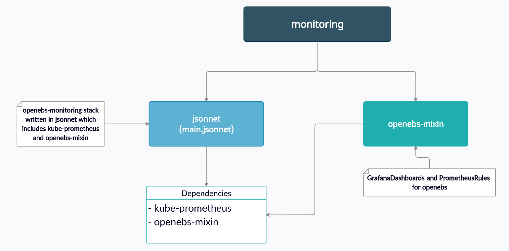

# openEBS Monitoring   



OpenEBS monitoring written in jsonnet has two components:
1. [**kube-prometheus stack**](https://github.com/prometheus-operator/kube-prometheus/tree/main/jsonnet/kube-prometheus)  
   It is a monitoring stack which includes prometheus, grafana and alertmanager.  
2. [**openebs-mixin**](https://github.com/openebs/monitoring/tree/develop/jsonnet/openebs-mixin)  
   It is a mixin for openebs. It includes all the dashboards and alert rules for different cas types of openebs which are used to import grafanaDashboards and create prometheusRules objects.

## Directory structure

- OpenEBS Monitoring  

	```
	jsonnet
	├── addons # openebs-monitoring addon
	│   ├── podMonitors.libsonnet # podMonitor to be created for different cas types
	│   ├── prometheusRules.libsonnet # create prometheusRule object which includes alert rules defined in openebs-mixin
	│   └── serviceMonitors.libsonnet # serviceMonitor to be created for different cas types
	|
	├── config.libsonnet # configuration to be used for openebs monitoing
	|
	├── jsonnetfile.json # direct dependencies
	├── jsonnetfile.lock.json # all dependencies with exact version
	|
	├── lib # contains code that is used in different places
	│   └── utils.libsonnet # code which is used to create openebs-monitoring addons
	|
	├── main.jsonnet # entrypoint of code(openEBS Monitoring)
	├── Makefile
	|
	└── openebs-mixin # contains grafanaDashboards and prometheusRules

	```  

- openebs-mixin


```
openebs-mixin # openebs-mixin for grafanaDashboards and prometheusRules.
    ├── build.sh
    ├── config.libsonnet # configuration that is used while writing dashboards and alert rules
    ├── dashboards
    │   ├── openebs/
    │   	├── . . . 
    │   ├── dashboards.libsonnet # to import all the dashboard json through grafanaDashboards object.
    |
    ├── jsonnetfile.json # direct dependencies
    |
    ├── lib
    │   ├── dashboards.jsonnet # to generate dashboards for helm charts
    │   └── rules.jsonnet # to generate alert rules for helm charts
    |
    ├── Makefile
    |
    ├── mixin.libsonnet # openebs-mixin that imports grafanaDashboards and prometheusRules
    |
    └── rules # contains alert rules for different cas types
        ├── openebs/
        	├── . . .
        ├── rules.libsonnet # used in openebs monitoring
        └── prometheus-rules.libsonnet # to create prometheusRules object
```